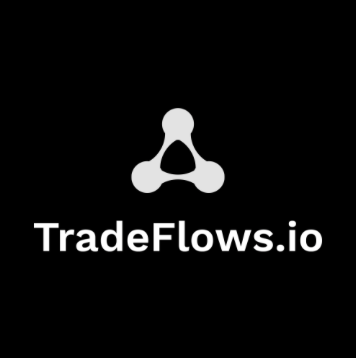

# TradeFlows Protocol - Hardhat Project

  

[TradeFlows](http://www.tradeflows.io) is a decentralised Commerce Protocol on [StarkNet](https://starkware.co/starknet/). Our goal is to provide a set of on-chain tools that allow our community to to build the best commercial experiences between each other in a transparent, permissionless and trustless manner. 

  

Current centralised trading workflows are: 
- Uncertain
- Opaque
- Slow; and 
- Costly

These factor have very adverse effects on global supply chains of both goods and services including an increase in the need and cost of financing due to this uncertainty.

Blockchain is able to mitigate all four negative effects using Smart Contracts that enable a sellers to:
- Describe a trade's conditions and payment terms;
- Mint an NFT that represents the trade;
- Allows the buyer to agree to the trade on-chain through custom NFT functionality;
- The buyer can then link payment streams to the NFT;
- Collateralise the payment streams in order to show an availability of funds without losing control over them. The seller knows that as long as the funds are in the self-custody contract, they will only be used to pay the stream;
- Rate each other while there is a trade alive through a non-transferable ERC20 token. This offers a high social rating with a degree of integrity since it can only be attributed by members whom which a wallet is trading with.

Usage
⚠️ WARNING! ⚠️
This repo contains highly experimental code. Expect rapid iteration. Use at your own risk.

 
## Architecture
The protocol is based on three infrastructure Smart Contracts:
- **DAO**: Custom ERC20 contract that represents the ownership of the DAO. This contract is also the treasury to which all Trade Init / Minting fees go to.
- **txTrade**: Custom ERC721 contract that stores the terms of the trade as a minted NFT. This contract also contains the functionality that allows the buyer to agree to the trade and the NFT is also the received of the programmed payment stream.
- **txDharma**: Custom ERC20 contract that is non-transferable and mintable. Community members that are in an active trade are able to mint these tokens to their counerpart's wallets or burn them when attributing a negative score.

and a set of ERC20 wrapper contracts that enable all custom streaming and escrow functionality:
- **txFlow**: Custom ERC20 contract that wraps around the target token, eg. USDC, and contains the streaming and self-custody functionality. This contract is also extended to attribute a balance to any ERC721 contract.

## Commercial Workflow
When starting on a commercial journey, both buyers and sellers
### Minting a Trade
Steps when creating a new trade:

Add money to wallet
1. Buyer and Seller trade ERC20 token (USDC) to their respective Flow tokens.
2. Seller approves a transfer for each Flow token the trade is linked to for the Trade contract to charge the respective fees
3. Seller mints a Trade NFT (_txTrade.init_) returning a tokenID.
4. Seller communicates the tokenID to the Buyer.
5. Buyer agrees to the trade (_txTrade.agree_) given the tokenID
6. Buyer and Seller can now start to rate each other (_txTrade.rate_) given the tokenId.
7. Buyer starts adding programmed Flow token cashflows to the trade (_txFlow.addNFTMaturityStream_) given the tokenId.
8. Service provider is now able to withdraw Flow tokens from the NFT Trade (_txFlow.withdrawAmountNFT_) that are streamed to them as time passes.
9. Both Service providers and Buyers are able to withdraw trade Flow tokens (_txFlow.withdrawBase_) for the base token (USDC).

## Contracts
During this alpha phase, we are deploying a set of test contracts to the Goerli Starknet testnet. The production contract will be deployed at a later date on to mainnet.
### Infrastructure Alpha on Goerli Testnet
| Contract |  Address |
:-------------------------:|:-------------------------: 
DAO      | [0x07702b971d8efd43b8826afb401b3effd0738c04abdf08defdce8de955638f8d](https://goerli.voyager.online/contract/)
txTrade  | [0x0336218a2e313a9a71b533a4422a4ad1460f31de43f938cba1bfd4a18668160c](https://goerli.voyager.online/contract/)
txDharma | [0x02642fbd5b5103c3f5616c2b3df744f69bdd0e576571b67d15cee444fd3eb074](https://goerli.voyager.online/contract/)

### Flows Alpha on Goerli Testnet
| Contract |  Address |
:-------------------------:|:-------------------------: 
ERC20 Test       | [0x01c2e7c375935aef0bdeb9ea80768dd3553ea58b025105640d40e1db597d984d](https://goerli.voyager.online/contract/)
ERC20 Test xFlow | [0x01c2e7c375935aef0bdeb9ea80768dd3553ea58b025105640d40e1db597d984d](https://goerli.voyager.online/contract/)

## Environment
The development environment is based on [Hardhat](https://hardhat.org/) and the [ShardLabs Starknet plugin](https://github.com/Shard-Labs/starknet-hardhat-plugin). To work with this project you must first clone this repo. 

### Install
Make sure you have [npm](https://www.npmjs.com) and [docker](https://www.docker.com/) installed. Then in this project's root folder run

    npm install

## Compile

Compile all the contracts

    npx hardhat run scripts/compile-contracts.ts

## Local vs Chain
The development environment is set through the [hardhat.config.ts](./hardhat.config.ts) file through the **network** property:

    network: "devnet", // for localhost or
    network: "alpha" // for testnet 

If devnet is chosen, ie. localhost, then the [shardlabs](https://github.com/Shard-Labs/starknet-devnet) docker container must be running:

    docker run -it -p 127.0.0.1:5050:5050 shardlabs/starknet-devnet

Upon start, the devnet will print out a list of wallet address and private keys with ETH. Use these in the **constants.ts** file as specified below.

## Deploy
The smart contracts are divided into two categories. Infrastructure contracts that manage the **DAO**, **Trade** and **Rating** functionality; and the flow

### Deploy Infrastructure

Instructure, ie. Trade and Dharma, contract deployment:

    npx hardhat run scripts/deploy-infrastructure.ts

### Deploy Wrapped Tokens

Wrapper token deployment. Please adapt the scripts for any new token to be deployed:

    npx hardhat run scripts/deploy-token.ts

## Testing

Please ensure the correct accounts are being used in the

    scripts/constants.ts

file. They will depend on the environment being devnet or alpha.

    export const walletAddressOwner = '0x7e754085377ed9fa47f5c719e2a0b61b97511f471a9ac3e81d1c66a3d635c8a'
    export const walletPrivateOwner = '0x7e93ff3898809a28b55777eaee38033'

    export const walletAddress0 = '0x7e754085377ed9fa47f5c719e2a0b61b97511f471a9ac3e81d1c66a3d635c8a'
    export const walletPrivate0 = '0x7e93ff3898809a28b55777eaee38033'

    export const walletAddress1 = '0x7dfc36361df72409a34356d61a5a0a7a2d55d17c720d1f12c675dc2cbfc144a'
    export const walletPrivate1 = '0x438d7be0a6921a39269c3a5c3ad2ae23'

Test workflow

    npx hardhat test test/start.ts

DESCRIPTIONS OF OTHER SCRIPTS!!!
